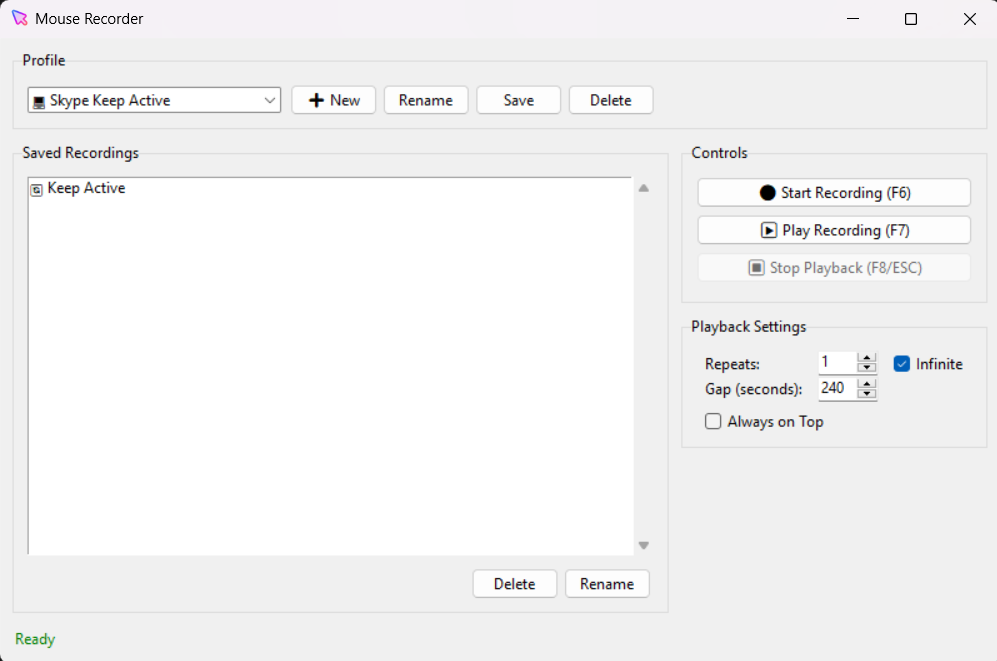

# Mouse Recorder


A simple tool to record and replay mouse movements and clicks.
You will figure out how to use it by yourself. :)

## Reason to make this?

Just don't want malicious software or any charging software to do this.

## Features

- Record mouse movements and clicks
- Replay recordings with customizable repeat counts
- Support for infinite loops
- Configurable gaps between repetitions
- Profile management
- Always-on-top option
- Global hotkeys (F6, F7, F8, ESC)

## Hotkeys

- F6: Start/Stop Recording
- F7: Play Recording
- F8/ESC: Stop Playback

## Installation

1. Download the latest release
2. Run the installer
3. Launch Mouse Recorder from the Start Menu

## Run Locally

1. Clone the repository

   ```bash
   git clone https://github.com/Argonaut790/Mouse-Recorder.git
   ```

2. Install dependencies

   ```bash
   poetry install
   ```

3. Run the application

   ```bash
   poetry run python recorder.py
   ```

## Usage

1. Create a new profile or use existing ones
2. Click "Start Recording" or press F6 to begin recording
3. Perform mouse movements and clicks
4. Press F6 again to stop recording
5. Select your recording and press F7 to play it back
6. Use F8 or ESC to stop playback at any time

## Default Profiles

- Skype Keep Active: Keeps Skype active by moving the mouse slightly every 4 minutes
- Default Profile: Empty profile for your recordings

## Contributing

Feel free to contact me to add more features by opening an issue or a pull request.
